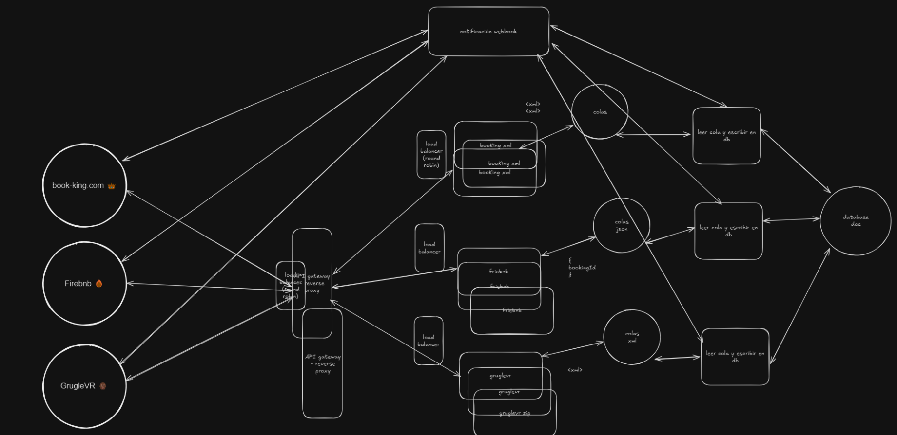

# System Design Challenge

## Uso

- Abrir archivo "index.excalidraw" en "https://excalidraw.com/".

## Instrucciones

Avantio es una plataforma tecnológica de alto tráfico a la que llegan reservas de diferentes portales.
Cada portal tiene un throughput propio de envío de reservas y además un formato diferente.

- Book-King.com: Aproximadamente 300 reservas por segundo. Envían un payload por reserva en formato XML con un modelo propio.
- Firebnb: Aproximadamente 200 reservas por segundo. Envían un payload por reserva en formato JSON con un modelo propio.
- GrugleVR: Aproximadamente 100 reservas por segundo. Envían un fichero ZIP que contiene un número de reservas entre [1, 25] en ficheros XML con un modelado propio.

Las reservas llegan a la plataforma mediante un POST a una URL que se le proporciona a cada portal.
Se requiere diseñar un sistema por el cual Avantio pueda procesar y persistir las reservas en su plataforma. Este sistema tiene que contar con las siguientes características:

- Altamente disponible
- Fácilmente escalable
- Tolerante a fallos
- Eficiente

## Solución

